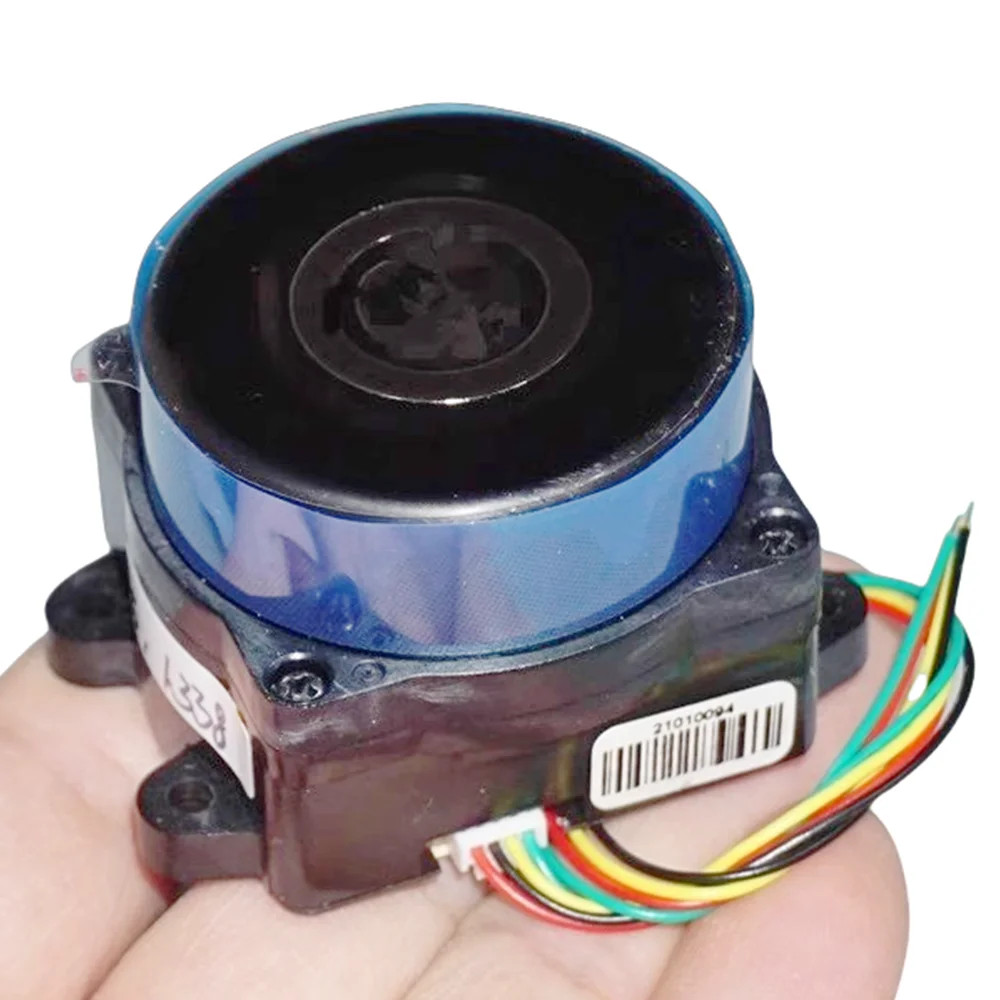

# Mini-360-Lidar 
### PCB text: T-WPFTB-V3.2.2

Reverse engineering of the Mini lidar from AliExpress.

The lidar can be found here: https://www.aliexpress.com/item/1005007119470172.html



The Mini 360 degree Lidar seems to be a lidar for LDRobot but I cant find a exect match, my guess is that this is a custom model.

The lidar seems to be used in the [360 Smart Life S10](https://smart.360.com/robot/s10.html) but it could be to a slightly difrent model as this replacement part is not identical: [replacment lidar](https://www.ep-mediastore-ab.de/360-s10-mini-lds-lidar-sensor-ld06-p-62332.html)

## Protocol
packages of 60 bytes:  
```
header: 8 bytes
data: 16 * 3 = 48 bytes
Trailer: 4 bytes
```
### normal package layout:   

```
<0x55><0xAA>  
<TYPE>  
<data_lenght>  
<speed_L><speed_H>  
<start_angle_L><start_angle_H>  
[measurement data 16x  <distance_L><distance_H><intensity>]  
<end_angle_L><end_angle_H>  
<crc16_L?><crc16_H?>  
```

Type: always 0x23
DATA_LENGHT always 0x10 (16 dec)  

``` c++
uint16_t start_angle = (((data[7] & 0x7F) << 8) + data[6]) - 0x2000;  

uint16_t distance = (((data[9+offset] & 0x3F) << 8) | data[8+offset]) * 0.1; // mm  
uint8_t xdata = data[9+offset] >> 6; // seems to indicate if it uses tof or triangelation but im not sure.... (changes from 1 to 0 at a distance of XXmm)  
uint8_t strength = data[10+offset];  
```

### example package:  
55 aa header  
23  type  
10 size(16 dec)  
6e 5a speed  
4e f7 start ange
61 43 47 data0  
6e 43 3e data1  
7f 43 08 data2  
30 87 00 data3  
00 86 00 data4  
91 41 06 data5  
86 41 09 data6  
75 41 0a data7  
68 41 09 data8  
5d 41 0a data9  
4f 41 0a data10  
47 41 0b data11  
3c 41 0c data12  
32 41 0c data13  
2c 41 0c data14  
22 41 0e data15  
d7 f9 end_angle  
e9 0b crc?  
